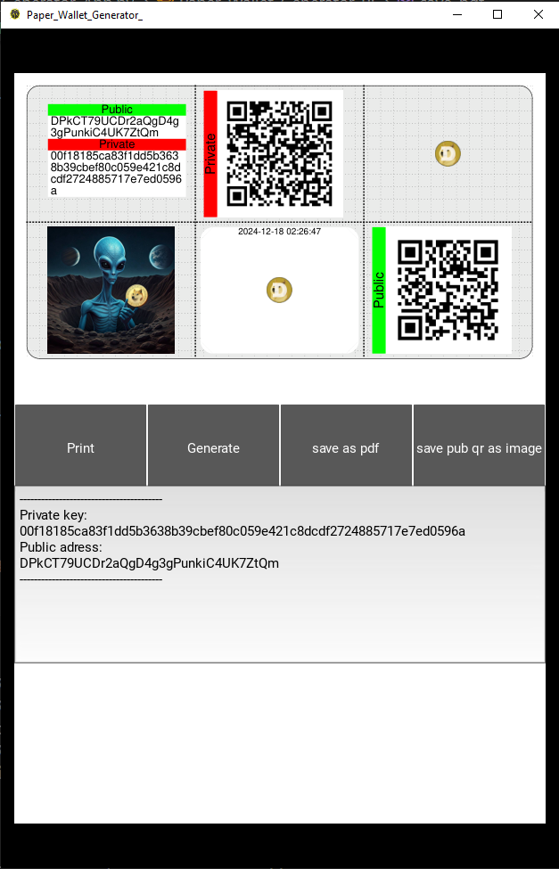

# Paper_Wallet_Generator_Doge
A kivy app that generates doge coin Paper wallets.
This app is meant to be used on an offline Windows computer 
(could also run on mac and linux beacuse its a kivy app (but not tested yet))

this is how it looks like:

how to use:
clone the repo using this command(because it has sub modules):
(git clone --recurse-submodules <main-repo-url>)

git clone --recurse-submodules https://github.com/Fleischkuechle/Paper_Wallet_Generator_Doge.git

First you need to install the requirements from requrements.txt on your python 3.10 environment.
then run Paper_Wallet_Generator_App.py

Gernerate - Generates a new paper wallet with new public key and address
print- prints the paper wallet to the default windows printer if there is one connected 
        (tested only on windows 10)

save as pdf - saves the paper wallet as a pdf file to the folder where the paper_Wallet_Generator_App.py
                is located.

After you printed it you can cut out the paper wallet 
then fold it on the horizontal fold line so that the printed areas are still visible.
then fold the alien image so it covers the private key qr code
then fold the public key qr code above so nobody can see your private key.

Update:
Added a save pub qr as image button that saves the qr code as a image file

